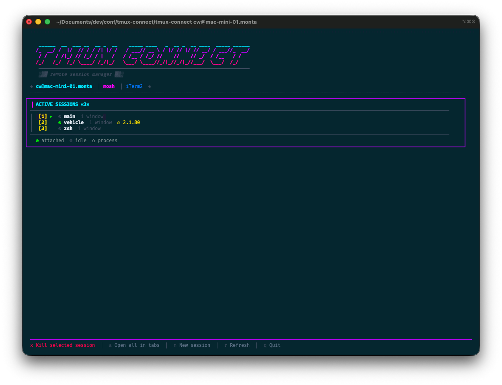

# TMUX CONNECT

A futuristic, feature-rich TUI for managing remote tmux sessions. Built with [Bubbletea](https://github.com/charmbracelet/bubbletea) + [Lipgloss](https://github.com/charmbracelet/lipgloss).



## Features

- **Session management** -- List, create, and kill remote tmux sessions
- **Window support** -- Expand sessions to see windows, create/kill individual windows, open specific windows in new tabs
- **New tab per session** -- Each session opens in a new terminal tab (iTerm2, Terminal.app)
- **Mosh or SSH** -- Uses mosh by default for lag-free connections, with SSH fallback
- **Auto-refresh** -- Session list refreshes every 10 seconds
- **Keyboard-driven** -- Full arrow key navigation + shortcut keys for everything
- **Cyberpunk UI** -- Gradient neon logo, styled session list, and a random engineering quote on every launch

## Installation

### From source

```bash
go install github.com/cweinberger/tmux-connect@latest
```

### Manual build

```bash
git clone https://github.com/cweinberger/tmux-connect.git
cd tmux-connect
go build -o tmux-connect .
```

### Dependencies

- **Go 1.21+**
- **ssh** (always required for fetching session info)
- **mosh** (optional, used by default for connections -- install with `brew install mosh`)

## Usage

```bash
# Connect via mosh (default)
tmux-connect user@remote-host

# Connect via SSH
tmux-connect --ssh user@remote-host
```

### Recommended: add an alias

```bash
alias tc="tmux-connect"
# or for a specific host:
alias tc-server="tmux-connect user@my-server"
```

## Controls

| Key | Action |
|-----|--------|
| `Up/Down` | Navigate sessions, windows, and menu |
| `Enter` | Open session/window in new tab |
| `Right` | Expand session to show windows |
| `Left` | Collapse session windows |
| `1-9` | Quick-open session by number |
| `a` | Open all sessions in tabs |
| `n` | Create new session |
| `w` | Create new window in selected session |
| `x` | Kill selected session or window |
| `r` | Refresh session list |
| `q` | Quit menu |
| `q q` | Quick quit (close all tabs & exit) |

## Terminal Support

> **Note:** tmux-connect is currently only tested and fully supported on **iTerm2** (macOS). Other terminals may work with limited functionality but are untested.

| Terminal | Tab opening | Tab closing | Status |
|----------|------------|-------------|--------|
| iTerm2 | Full support | Full support | **Tested** |
| Terminal.app | Basic support | Limited | Untested |
| Other | Foreground attach | N/A | Untested |

When opening tabs in iTerm2, tmux-connect stays on the current tab -- new sessions open in the background.

## How it works

tmux-connect uses SSH to query the remote tmux server for session and window information, then opens new terminal tabs via AppleScript (macOS). Connections use mosh by default for better latency handling, falling back to SSH with the `--ssh` flag.

Commands typed into new tabs are prefixed with a space to avoid polluting shell history.

## License

MIT
